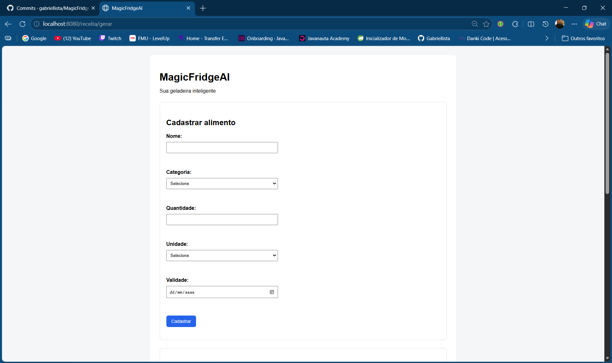
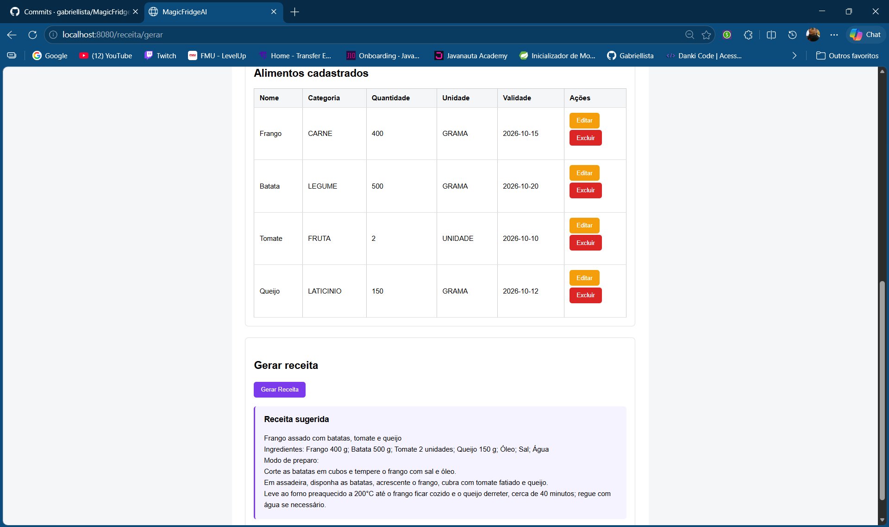

# 🧊 MagicFridgeAI

O MagicFridgeAI é uma aplicação web desenvolvida com Java e Spring Boot para gerenciar alimentos armazenados em uma geladeira e gerar sugestões de receitas utilizando Inteligência Artificial.

O usuário pode cadastrar os alimentos disponíveis, informando nome, categoria, quantidade, unidade de medida e data de validade. A aplicação utiliza esses alimentos para montar um prompt e enviar uma requisição para a API da OpenAI, que retorna uma sugestão de receita.

## 🖥️ Interface

### Cadastro de alimentos



### Alimentos cadastrados e geração de receita



## 📌 Funcionalidades

- Cadastro, listagem, edição e exclusão de alimentos
- Validação dos dados informados
- Persistência dos dados em banco H2
- Versionamento do banco de dados com Flyway
- Geração de receitas com Inteligência Artificial
- Integração com a API da OpenAI
- Tratamento de erros da integração com IA
- Interface web com Thymeleaf
- Interface responsiva para dispositivos móveis
- Endpoint REST para geração de receitas

## 🛠️ Tecnologias utilizadas

- Java 17
- Spring Boot 4.1.1
- Spring MVC
- Spring Data JPA
- Hibernate
- Thymeleaf
- Bean Validation
- WebClient
- H2 Database
- Flyway
- Maven
- Lombok
- HTML
- CSS
- OpenAI API

## 🏗️ Arquitetura

O projeto foi organizado em camadas para separar as responsabilidades da aplicação.

```text
Controller
    ↓
Service
    ↓
Repository
    ↓
Banco de Dados
```

### Principais responsabilidades

- **Controller:** recebe as requisições HTTP e controla a navegação da aplicação.
- **Service:** contém as regras de negócio.
- **Repository:** realiza o acesso ao banco de dados através do Spring Data JPA.
- **Model:** representa as entidades e dados utilizados pela aplicação.
- **Config:** contém configurações como o cliente HTTP utilizado para acessar a OpenAI.
- **Exception:** centraliza o tratamento de erros da API.

### Fluxo de geração de receita

```text
Usuário
   ↓
HomeController / AiController
   ↓
ReceitaService
   ↓
FoodItemService
   ↓
Alimentos cadastrados
   ↓
ReceitaService monta o prompt
   ↓
ChatGptService
   ↓
WebClient
   ↓
OpenAI API
   ↓
Receita gerada
```

## 🚀 Como executar o projeto

### Pré-requisitos

Para executar o projeto é necessário ter instalado:

- Java 17
- Git
- Uma chave de API da OpenAI

O Maven Wrapper já está incluído no projeto, portanto não é necessário instalar o Maven separadamente.

### 1. Clone o repositório

```bash
git clone https://github.com/gabriellista/MagicFridgeAI.git
```

Entre na pasta do projeto:

```bash
cd MagicFridgeAI
```

### 2. Configure a API Key da OpenAI

A chave da OpenAI não é armazenada no projeto por questões de segurança.

A aplicação espera encontrar a variável de ambiente:

```text
OPENAI_API_KEY
```

No Windows PowerShell:

```powershell
$env:OPENAI_API_KEY="sua-chave-aqui"
```

No Linux ou macOS:

```bash
export OPENAI_API_KEY="sua-chave-aqui"
```

> Nunca coloque sua chave real diretamente no `application.properties` ou envie a chave para o GitHub.

### 3. Execute os testes

No Windows:

```powershell
.\mvnw.cmd test
```

No Linux ou macOS:

```bash
./mvnw test
```

### 4. Execute a aplicação

No Windows:

```powershell
.\mvnw.cmd spring-boot:run
```

No Linux ou macOS:

```bash
./mvnw spring-boot:run
```

Depois, acesse:

```text
http://localhost:8080
```

### Console do H2

Durante o desenvolvimento, o console do banco H2 pode ser acessado em:

```text
http://localhost:8080/h2-console
```

Configuração utilizada:

```text
JDBC URL: jdbc:h2:file:./data/magicfridge
User Name: sa
Password: deixe em branco
```

## 🌐 Endpoints

### Alimentos

| Método | Endpoint | Descrição |
|---|---|---|
| GET | `/food` | Lista todos os alimentos |
| GET | `/food/{id}` | Busca um alimento pelo ID |
| POST | `/food` | Cadastra um novo alimento |
| PUT | `/food/{id}` | Atualiza um alimento existente |
| DELETE | `/food/{id}` | Exclui um alimento |

### Inteligência Artificial

| Método | Endpoint | Descrição |
|---|---|---|
| POST | `/ai/receita` | Gera uma receita utilizando os alimentos cadastrados |

## 🧪 Testes

O projeto utiliza o suporte de testes do Spring Boot.

Atualmente existe um teste de contexto que verifica se a aplicação consegue inicializar corretamente e se os componentes do Spring podem ser carregados.

Para executar os testes:

```powershell
.\mvnw.cmd test
```

Resultado esperado:

```text
Tests run: 1, Failures: 0, Errors: 0
BUILD SUCCESS
```

Durante os testes é utilizada uma chave fictícia para a configuração da OpenAI, evitando a necessidade de utilizar ou expor uma chave real.

## 📚 Aprendizados

Durante o desenvolvimento do MagicFridgeAI foram praticados conceitos como:

- Organização de uma aplicação Spring Boot em camadas
- Criação de CRUD com Spring MVC e Spring Data JPA
- Persistência de dados com JPA e Hibernate
- Versionamento do banco de dados com Flyway
- Validação de dados com Bean Validation
- Tratamento de exceções
- Uso de enums para representar categorias e unidades de medida
- Criação de páginas dinâmicas com Thymeleaf
- Integração com APIs externas utilizando WebClient
- Uso seguro de variáveis de ambiente para credenciais
- Integração com a API da OpenAI
- Construção e refinamento de prompts
- Tratamento de falhas em serviços externos
- Debugging através de logs, stack traces, Postman e DevTools
- Criação de interface responsiva com HTML e CSS
- Testes de inicialização do contexto do Spring
- Uso de Git e GitHub durante a evolução do projeto

Um dos principais aprendizados do projeto foi entender que uma funcionalidade não deve apenas funcionar no cenário ideal. A integração com a OpenAI também foi preparada para tratar falhas de forma controlada, mantendo a aplicação disponível e exibindo uma mensagem amigável para o usuário.

## 👨‍💻 Autor

Desenvolvido por Gabriel Lista como projeto de estudo de Java, Spring Boot e integração com Inteligência Artificial.